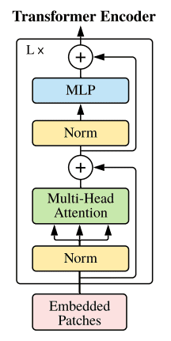

# **3D Reconstruction from Single Image Using Occupancy Network with Vision Transformer Architecture**

The project aims to improve the performance of the Occupancy Network by incorporating the Vision Transformer (ViT) architecture into the model.

Please view our slides here:     
Please view our report here:    

## 1. How to run this project?
Please refer to the Jupyter Notebook file for training, mesh generation, and evaluation
- ViTOcNet.ipynb  
## 2. Dataset
Download the preprocessed ShapeNet dataset and please prepare a large space (better if more than about 73.4 GB) for it.  
A GPU environment is preferred.  Dataset will not be published due to large data size but dowload script is a part of the Jupyter Notebook mentioned above.

## **1. Occupancy Networks: Learning 3D Reconstruction in Function Space**

### **Approach**

Instead of reconstructing a 3D shape in the form of a (discrete) voxel grid, point cloud, or mesh from the input data, occupancy networks return a function that predicts an occupancy probability for a continuous 3D point.

The trick is the following: a function that takes an observation x as input and returns a function mapping a 3D point p to the occupancy probability can be replaced by a function that takes a pair (p, x) and returns the occupancy probability.

Limitations of existing 3D data representations
- Voxel grids: memory-heavy, up to 128^3–256^3 maximum resolution
- Point clouds: need post-processing to generate a (mesh) surface
- Meshes: existing approaches often require additional regularization, can generate only meshes with simple topology, need the same class reference template, or cannot guarantee closed surfaces

### **Pipeline**
- **Training:** the occupancy network fθ(p, x) takes as input the task-specific object (for example, for single image 3D reconstruction this would be an RGB image) and a batch of 3D points, randomly sampled from the ground truth 3D representation. For each 3D point, the network predicts the occupancy probability, which is then compared with the ground truth to compute the mini-batch loss.

- **Inference**: to extract a 3D mesh from the learned fθ(p, x), the paper uses a Multiresolution IsoSurface Extraction (MISE) algorithm, which as a first step is building an octree by progressively sampling the points where neighbors' occupancy predictions do not match. After that, the Marching Cubes algorithm is applied to extract the mesh surface.

### ** Occupancy Network Architecture**
- The network architecture is generally the same across different tasks (e.g. single image 3D reconstruction or point cloud completion) with the task-specific encoder being the only changing element.

- Once the task encoder has produced the embedding c, it is passed as input along with the batch of T sampled 3D points, which are processed by 5 sequential ResNet blocks. To condition the network output on the input embedding c, Conditional Batch Normalization is used.

- For single image 3D reconstruction, the network uses a Vision Transformer (ViT) encoder with altered last layers to produce 256-dim embeddings.

## **2. ViT: Vision Transformers**

### **Approach**
Vision Transformer (ViT) is a state-of-the-art image recognition model using the Transformer architecture. It treats the input image as a sequence of flattened patches and processes them using Transformer's self-attention mechanism.

### **Network Architecture**

ViT has two major components:
  - A Patch Embedding Module
  - A Transformer Encoder

- ViT takes an input image and divides it into fixed-size patches, which are then linearly embedded to obtain a sequence of embeddings. The positional encodings are added to these embeddings to provide spatial information.
- The sequence of embeddings is then fed into the Transformer encoder, which processes them using multi-head self-attention layers.

Dividing the image and adding positional embeddings:

### **2D Positional Encoding**
- ViT uses a fixed positional encoding similar to the one used in the original Transformer.

### **Transformers**

- The Transformer encoder enriches embeddings through the multi-head self-attention layers. One notable difference from the original encoder is that ViT adds the positional encodings to the input of each multi-head attention layer.
- ViT does not have a decoder as it is primarily used for image classification tasks. However, the output embeddings can be used for various downstream tasks.

## **3. Proposed Architecture ( ViTOcNet )**

The proposed network for 3D reconstruction from a single image consists of:
   -   The ResNet Backbone for feature extraction used in Occupancy Network is replaced with Vision Transformer.
   -   Conditional batch normalization was utilized to effectively integrate the point cloud and embedding data.
   -   Standard CNN was employed instead of fully-connected ResNet-blocks to generate occupancy probabilities.

By incorporating the Vision Transformer into the Occupancy Network, we aimed to leverage the powerful capabilities of self-attention and improve the performance of 3D reconstruction tasks.

Results:
The original network turned out to be a more powerful model for 3D reconstruction. However, due to the limitation of hardware and time resources, the limit performance of our model could not be tested. 

